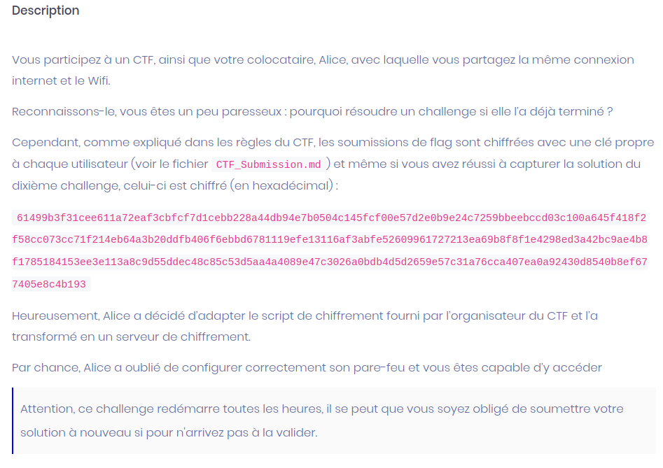

# Crypto be crush



Nous voici sur un challenge de crypto autout d'AES CBC.

Pour plus d'informations : https://fr.wikipedia.org/wiki/Mode_d%27op%C3%A9ration_(cryptographie)

On nous fournit un message chiffré intercepté qu'il va nous falloir décrypter, ainsi que quelques fichiers :

- Submission.md : les caractéristiques de l'échange
- encrypt_challenge.py : le script qui tourne sur le serveur et sert à chiffre nos soumissions de message
- ex_flag.json : un exemple de donnée en clair


## Analyse

Pour le moment nous disposons :
- du chiffré
- d'un moyen de chiffrer d'autres messages
- de la structure sous-jacente au clair

Quelques indices sont à récupérer dans l'énoncé : notre chiffré correspond au flag soumis par Alice pour le 10e challenge.

Nous pouvons alors supposer que le clair est de la forme :

{"sig":"80a7ccd5aa2f3b0f917267640c6ff37c50e7f3673a30d20c0e133fe8c20d5cd1","flag":"DG'hAck-{{b51613f7}}","user":"Alice","cid":10}


(Bien sur b51613f7 n'est pas le flag ...)

De façon intéressante un tel clair fait 128 octets, soit 8 blocs de 16 octets.

Par ailleurs le chiffré :

```
IV
61499b3f31cee611a72eaf3cbfcf7d1c  -> bloc 1

ebb228a44db94e7b0504c145fcf00e57  -> bloc 2
d2e0b9e24c7259bbeebccd03c100a645  -> bloc 3
f418f2f58cc073cc71f214eb64a3b20d  -> bloc 4
dfb406f6ebbd6781119efe13116af3ab  -> bloc 5
fe52609961727213ea69b8f8f1e4298e  -> bloc 6
d3a42bc9ae4b8f1785184153ee3e113a  -> bloc 7
8c9d55ddec48c85c53d5aa4a4089e47c  -> bloc 8
3026a0bdb4d5d2659e57c31a76cca407  -> bloc 9

padding
ea0a92430d8540b8ef677405e8c4b193  -> bloc 10
```

Si notre supposition est bonne, le chiffré comprend alors :
- l'IV en entête
- 8 bloc de message chiffré
- 1 bloc de padding, chiffré

En effet comme la taille du clair serait un multiple de AES.block_size, le padding ajouté est un bloc entier de "\x10\x10....\x10".

## Vérification

Pour vérifier notre hypothèse, nous allons soumettre un bloc de padding et voir s'il est chiffré en notre bloc n°10.

Il faut un peu préparer ce bloc avant, en deux temps.

1- En effet : `Cn = chiff( Pn xor Cn-1 )`


Un bloc chiffré Cn correspond au chiffrement du bloc clair correspondant Pn xoré avec le bloc chiffré précédent (mode CBC)

Notre bloc n°10 serait donc le chiffré d'un bloc de padding xoré au bloc n°9.

2 - Ensuite quand nous allons utiliser le serveur

Si on envoit un bloc P de 16 octets au serveur, celui ci nous répond 3 blocs de 16 octets:

`| IV | C | padding |`


Où C n'est pas le chiffré de P, mais le chiffré de P xor IV.


Heureusement pour nous, l’interaction avec ce dernier se fait en 2 temps
- 1 il nous donne l'iv qu'il va utiliser
- 2 il nous demande notre message


Au final pour tester notre idée, on envoit au serveur : **padding** xor **bloc9** xor **iv**

Le serveur effectue **chiffrement( padding** xor **bloc9** xor **iv** xor **iv ) = chiffrement(padding** xor **bloc9)**

Et il nous retourne bien la valeur du bloc n°10.


Pour être sûr que les données sont sous la forme présupposée, nous recommençons avec le bloc précédent.
En effet, le bloc 9 devrait être le chiffré des 16 derniers octets du clair, à savoir : **Alice","cid":10}**

On demande un IV au serveur puis on lui soumet notre chaine xorée avec l'iv et xorée avec le bloc 8.

Le serveur nous répond : **3026a0bdb4d5d2659e57c31a76cca407** soit notre bloc 9 qui est bien le chiffré de la fin de notre structure :-)

## Exploitation

Maintenant on peut deviner une partie des 2 blocs précédents

**13f7}}","user":"** et **:"DG'hAck-{{b516**

Bien sûr avec des inconnus à la place des valeurs du flag. Mais pour chacun d'entre eux on connait 12 octets sur les 16. On a juste à bruteforcer les 4 autres.

Ci après le script utilisé, tel quel (toujours quick & dirty :) )

En gros le chiffré est stocké en liste de blocs de 16 octets.

Le clair supposé est bruteforcé sur les 4 octets qui manquent et comparé avec son chiffré.
A chaque soumission bien sur il faut récupérer l'iv que le serveur propose et soumettre un bloc doublement xoré (avec l'iv et avec le bloc chiffré qui le précède)


```python
#!/usr/bin/env python3
from Crypto.Cipher import AES
from Crypto import Random
import secrets
import socket
from time import sleep
from random import randint

CIPHER = bytes.fromhex(open('cipher.txt', 'r').read())

HOST = "cryptobecrushed.chall.malicecyber.com"
PORT = 4242

def pkcs7_padding(m):
    # There is padding and there is PKCS#7 padding
    l = len(m)
    pad_len = 16 - (l % 16)
    pad_len_hex = pad_len.to_bytes(1, byteorder="little")
    padding = bytes([pad_len_hex[0] for i in range(0, pad_len)])

    return m+padding


def decrypt(iv, m):

    cipher = AES.new(KEY, AES.MODE_CBC, iv)
    return cipher.decrypt(m)

def xor(key, cipher):
	return bytes(a ^ b for a, b in zip(key, cipher) )


def affich(last, iv_tmp, ciphered_block, serv_cipher):
    print('Last : ', last)
    print('size : ', len(last) )
    print('Iv server : ' + iv_tmp)
    print( 'Block : ', ciphered_block )
    print( 'Serv cipher : ' + serv_cipher )
    print( 'Size : ', len(serv_cipher ))
    print("\n")

if __name__ == "__main__":

    print("[+] Import des donnees initiales")
    print(">>>Input challenge :", CIPHER.hex() )
    iv = CIPHER[0 : AES.block_size ]
    ciphered = CIPHER[AES.block_size:]
    print(">>>Iv : ", iv.hex() )
    print(">>>Ciphered :", ciphered.hex() )
    print(">>>Len : ", len(ciphered))
    print("\n")

    # decoupage en bloc de 16 octets du chiffre
    ciphered_blocks = []
    nb_block = int( len(ciphered) / ( AES.block_size ) )
    print("Nb de block : ", nb_block )
    for i in range(nb_block):
        ciphered_blocks.append( ciphered[i * AES.block_size : (i+1) * AES.block_size ])


    print("[+] Test sur le bloc de clair connu")

    # pour faire le test sur le dernier bloc = padding    
    # last = pkcs7_padding(b'')
    # n = 8

    # pour faire le test sur le dernier bloc du clair
    last = b'Alice","cid":10}'
    n = 7

    # connexion au serveur
    s = socket.socket(socket.AF_INET, socket.SOCK_STREAM)
    s.connect((HOST, PORT))

    rep = s.recv(1024)
    print(rep)    
    # recuperation de l iv utilisee par le serveur
    iv_tmp = str(rep).split('\\n')[1]

    # preparation du message a soumettre
    message = xor( last, ciphered_blocks[ n - 1] ) 
    message = xor(message, bytes.fromhex(iv_tmp))

    # envoi
    s.send( bytes( message.hex(), 'utf-8') + b'\n' )
    rep = s.recv(1024)

    serv_cipher = rep.decode('utf-8')
    serv_cipher = serv_cipher.split('\n')[0]
    serv_cipher = serv_cipher.split(' ')[2]
    serv_cipher = serv_cipher[32:64]

    # affichage
    affich( last, iv_tmp, ciphered_blocks[ n - 1], serv_cipher )

    # test d egalite
    print( serv_cipher == ciphered_blocks[ n ].hex())

    print("[+] Automatisation  / BF sur une partie du flag")

    
    # fin du flag
    #last = b'}}","user":"'
    # n = 6

    # debut du flag
    last = b':"DG\'hAck-{{'
    n = 5

    # hex_alph = '0123456789abcdef'
    hex_alph = 'edcba9876543210'

    for b1 in hex_alph:
        for b2 in hex_alph:
            for b3 in hex_alph:
                for b4 in hex_alph:
 
                    iv_tmp = rep.decode('utf-8').split('\n')[3]

                    last = b':"DG'+ b"'" +b'hAck-{{' + b1.encode('utf-8') + b2.encode('utf-8') + b3.encode('utf-8') + b4.encode('utf-8')
                    
                    message = xor( last, ciphered_blocks[ n - 1] )
                    message = xor(message, bytes.fromhex(iv_tmp))

                    s.send( bytes( message.hex(), 'utf-8') + b'\n' )
                    rep = s.recv(1024)

                    serv_cipher = rep.decode('utf-8')
                    serv_cipher = serv_cipher.split('\n')[0]
                    serv_cipher = serv_cipher.split(' ')[2]
                    serv_cipher = serv_cipher[32:64]

                    if ( serv_cipher == ciphered_blocks[ n ].hex()):

                        affich( last, iv_tmp, ciphered_blocks[ n - 1 ], serv_cipher )
                        print( b1, b2, b3, b4 )
                        break
                        break
                        break
                        break


```

# DG'hAck-{{e20eb967}}

