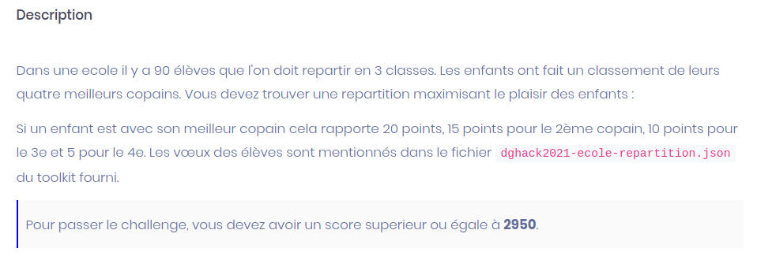
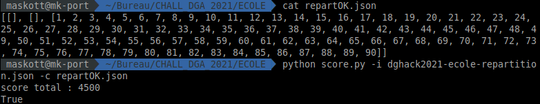
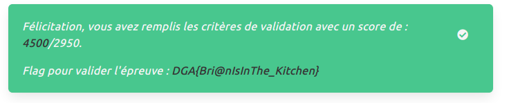

# Ecole





Nous voici devant ce qui ressemble à un challenge de dévellopement. Il s'agit de trier des élèves selon leur souhaits, afin d'honorer un maximum d'entre eux et marquer ainsi un score maximal.

## Approche de test

Ma première approche a été de réaliser un classement pseudo aléatoire des éléves afin de déterminer le score moyen obtenu aléatoirement. Puis d'essayer de l'optimiser.

```python


#!/usr/bin/python3

import random

random.seed()

NB_ELEVE = 90
cpt = 0

classe_1 = []
classe_2 = []
classe_3 = []

eleves = []

while len(eleves) < NB_ELEVE:
	tmp = random.randint(1,90)
	if tmp not in eleves:
		eleves.append(tmp)
	cpt += 1

classe_1 = eleves[0:30]
classe_2 = eleves[30:60]
classe_3 = eleves[60:90]

print(classe_1, classe_2, classe_3)

out = open("repart.json","w")
out.write(str([classe_1, classe_2, classe_3]))

```

Le test de différentes combinaisons aléatoires donne un score de 1300 à 1800 points.

Loin d'être optimal...


## Examen des sources fournies

Le challenge fourni un certain nombre de fichiers :

- dghack2021-ecole-repartition.json : sous format Json, les desideratas des élèves.
- test.json : un exemple initié de ce que nous devons renvoyer
- score.py : l'algorithme de test chargé de cacluler notre score.

Pourquoi nous fournit-on ce dernier fichier ?

En regardant un peu plus dans le détail le fichier score.py ... nous pouvons remarquer une erreur d'implémantation dans la vérification.

```python
def score_total_with_error_notification(classes, eleves):
    for i in range(0, 2):   #<== ICI
        if len(classes[i]) > 30:
            raise ValueError("Une classe ne peut pas contenir plus de 30 élèves.")
        for e in classes[i]:
            if e in classes[(i + 1) % 3] or e in classes[(i + 2) % 3]:
                raise ValueError("Un élève ne peut pas être dans deux classes.")
            if classes[i].count(e) > 1:
                raise ValueError("Un élève ne peut pas être deux fois dans une classe.")
```

1 - Le nombre d'élève est mal testé. Une classe peut-être vide.

2 - Celui-ci ne vérifie les score que des classes 0 et 1 : range(0,2) == [0, 1]

## Exploitation

Si nous renvoyons 2 classes vides et une classe contenant tous les élèves, alors le score sera maximal. Tous les élèves auront tous leurs amis dans la même classe.



## Validation

Il suffit alors de générer la liste suivante :

```
[[], [], [1, 2, 3, 4, 5, 6, 7, 8, 9, 10, 11, 12, 13, 14, 15, 16, 17, 18, 19, 20, 21, 22, 23, 24, 25, 26, 27, 28, 29, 30, 31, 32, 33, 34, 35, 36, 37, 38, 39, 40, 41, 42, 43, 44, 45, 46, 47, 48, 49, 50, 51, 52, 53, 54, 55, 56, 57, 58, 59, 60, 61, 62, 63, 64, 65, 66, 67, 68, 69, 70, 71, 72, 73, 74, 75, 76, 77, 78, 79, 80, 81, 82, 83, 84, 85, 86, 87, 88, 89, 90]]
```

On soumet ce fichier sur l'URL de validation du challenge et on obtient le score maximal :


