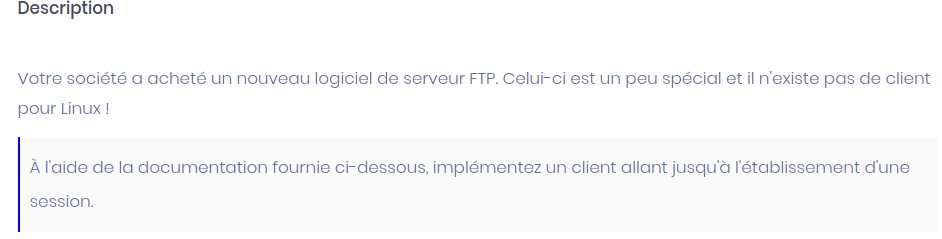
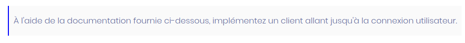
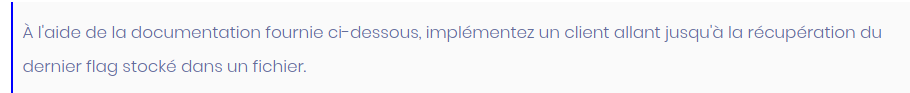

# Seecure FTP over UDP





Ce challenge nous demande de coder un client pour interagir avec un serveur FTP par le protocole UDP.
Il se déroule en trois étapes qui sont décrites dans le fichier de consignes fourni.

Les spécifications des échanges nous sont données en pièce jointe.

Il n'y a qu'à coder en suivant le cahier des charges, modulo quelques tâtonnement quand les consignes sont un peu floues (transmission et utilisation de l'IV ...) et  pour la mise en forme de la clef publique RSA.

Désolé pour la suite, je ne vais pas détailler, je colle juste mon code.
Il y'a sûrement mieux ... il est tel que je l'ai codé au fur et à mesure du challenge.

```python
#!/usr/bin/python3

import socket
from zlib import crc32
from base64 import b64decode, b64encode
from Crypto.Cipher import AES, PKCS1_v1_5
from Crypto.PublicKey import RSA
from Crypto.Util.Padding import pad
import os
from itertools import cycle
from time import sleep

host = "secure-ftp.dghack.fr"
port = 4445

id = b"GUEST_USER"
passwd = b"GUEST_PASSWORD"

socket = socket.socket(socket.AF_INET, socket.SOCK_DGRAM)
socket.connect((host, port))

print( "[+] Connection on {}".format(port) )


# Les 14 bits les plus significatifs ID du paquet.
# Les 2 bits les moins significatifs taille en octet de la section taille
entete = 0

# La section taille a une longueur variable de 1 a 3 octets longueur de la section contenu en octets.
size = 0

content = ""

# Somme de controle stockee sur 4 octets
CRC = 0

def nb_octet_entier( nb ):
	if 0<=nb<=255:
		return 1
	if 256<=nb<=65535:
		return 2

def format_string( message ):
	return len(message).to_bytes(2, byteorder='big') + message.encode('utf-8')


def string_to_hex_bytes( string ):
	nb = 0
	tmp = 0
	tmp2 = 0
	for c in string:
		tmp = nb << 8
		tmp2 = tmp | ord(c)
		nb = tmp2
	return nb

def xor(key, cipher):
	return bytes(a ^ b for a, b in zip(cycle(key), cipher) )

def send_content( msg_id, data ):

	size = len( data )
	nb_octet_size = nb_octet_entier(size)
	entete = ( (msg_id<<2) | nb_octet_size ).to_bytes(2, byteorder='big')
	message = entete + size.to_bytes(nb_octet_size, byteorder='big') + data
	CRC = crc32(message).to_bytes(4, byteorder='big')

	print("[+] Msg type {0} envoyé".format(msg_id))
	sleep(0.05)
	socket.send(message + CRC + b'\n')


def parse_rep( reponse ):

	reponse = reponse.decode('latin-1')
	entete_octet1 = ord( reponse[0:1] )
	entete_octet2 = ord( reponse[1:2] )

	entete = string_to_hex_bytes( reponse[0:2] )
	nb_octet_size =  entete & 3
	entete = entete >> 2
	size_totale = string_to_hex_bytes(reponse[2:2+nb_octet_size])
	size_recup = 0
	datas = []
	while size_recup < size_totale:
		size = string_to_hex_bytes( reponse[ 2 + nb_octet_size + size_recup : 2 + nb_octet_size + size_recup + 2 ] )
		datas.append( reponse[2+nb_octet_size + size_recup + 2 : 2 + nb_octet_size + size_recup + 2 + size] )
		size_recup += size + 2

	print("[+] Message type {0} recu".format(entete))
	return datas


# message de connexion
send_content(1921, format_string("CONNECT") )
rep = socket.recv(1024)
session_id, flag1 = parse_rep(rep)
print("Session ID :", session_id)
print("Flag1 :", flag1)

# recup public key :RsaKeyMessage
send_content(78,format_string(session_id) )
rep = socket.recv(2048)
key_encoded = parse_rep(rep)[0]

xor_key = b'ThisIsNotSoSecretPleaseChangeIt'
servPubKey =  xor( xor_key, b64decode( key_encoded ))

with open("pub.txt", "wb") as f:
	f.write(b'-----BEGIN PUBLIC KEY-----\n')
	f.write( b64encode( servPubKey ) )
	f.write(b'\n')
	f.write(b'-----END PUBLIC KEY-----\n')


# SessionKeyMessage 1337
aes_key = os.urandom(32)
print("AES key : ", b64encode(aes_key))
keyPub = RSA.import_key( open("pub.txt","r").read() )
encryptor = PKCS1_v1_5.new( keyPub )
msg = encryptor.encrypt( aes_key )

send_content(1337, format_string(session_id) + format_string( b64encode( msg ).decode('utf-8') ) )

# SessionKeyReply 1338
rep = socket.recv(2048)
datas = parse_rep(rep)[0]
datas = b64decode(datas.encode())
iv = datas[0:16]
print("IV : ", b64encode(iv))
session_tab = datas[16:]
print("Sel : ", b64encode(session_tab))

aes_cipher = AES.new(aes_key, AES.MODE_CBC, iv)
sel = aes_cipher.decrypt(session_tab)
print(sel)
sel = sel[0:10]
print(sel)
print(b64encode(sel))

# AuthMessage 4444
aes_cipher = AES.new(aes_key, AES.MODE_CBC, iv)
sel = b64encode( iv + aes_cipher.encrypt(pad(sel,AES.block_size)) ).decode('latin-1')
print(sel)

aes_cipher = AES.new(aes_key, AES.MODE_CBC, iv)
id_cipher = b64encode( iv + aes_cipher.encrypt(pad(id,AES.block_size)) ).decode('latin-1')

aes_cipher = AES.new(aes_key, AES.MODE_CBC, iv)
mdp_cipher = b64encode( iv + aes_cipher.encrypt(pad(passwd, AES.block_size)) ).decode('latin-1')

send_content(4444, format_string(session_id) + format_string( sel ) + format_string( id_cipher) + format_string( mdp_cipher) )

# AuthReply 6789
rep = socket.recv(2048)
print(parse_rep(rep))

# GetFilesMessage 45
aes_cipher = AES.new(aes_key, AES.MODE_CBC, iv)
path = b64encode( iv + aes_cipher.encrypt(pad(b'/opt/dga2021', AES.block_size)) ).decode('latin-1')

send_content(45, format_string(session_id) + format_string(path))

# GetFilesReply 46
rep = socket.recv(2048)
files = parse_rep(rep)[0]
files = b64decode(files)
iv = files[0:16]
aes_cipher = AES.new(aes_key, AES.MODE_CBC, iv)
files = aes_cipher.decrypt( files[16:] )
print(files.decode('latin-1').split('\x00'))

# GetFileMessage 666
aes_cipher = AES.new(aes_key, AES.MODE_CBC, iv)
fichier = b64encode( iv + aes_cipher.encrypt(pad(b'/opt/dga2021/flag', AES.block_size)) ).decode('latin-1')
send_content(666, format_string(session_id) + format_string(fichier))


# GetFileReply
rep = socket.recv(1024)
flag = parse_rep(rep)[0]
flag = b64decode(flag)
iv = flag[0:16]
aes_cipher = AES.new(aes_key, AES.MODE_CBC, iv)
flag = aes_cipher.decrypt( flag[16:] )
print(flag.decode('latin-1'))

print( "Close" )
socket.close()
```
