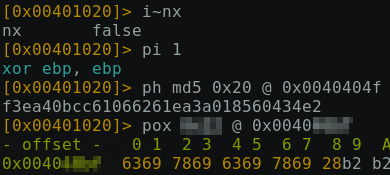

# Yet Another Ridiculous Acronyme

Le challenge nous propose un peu plus de 900 binaires et une capture de caractériqtiques de l'un d'entre eux émise depuis radare2.




## Tour d'horizon

Le tire du challenge suppose l'écriture de règles YARA pour parser l'ensemble du sample et retrouver le fameux binaire.

Néanmoins la partie floutée laisse supposer que cette démarche nécessitera une boucle ou un brute force sur un range de 0x0000 à 0xffff adresses avec une valeur xorée.

Avant d'en arriver là, peut-être est-il possible de procéder trivialement par élimination.

## Elimintation

Un petit script en bash pour ne garder que les binaires satisfaisants le premier test.

```bash
#!/bin/bash

for i in samples/*; do
	if [ -f $i ]; then
		if ( checksec --file=$i | grep "NX disabled" ); then
			cp $i samplesNX/ ;
		fi
	fi
done
```
On récupère dans samplesNX/ 391 binaires

Puis avec python et la bibliothèque de radare, on peut vérifier la 3e condition sur ces binaires.

```python
#!/usr/bin/pyhton3

import r2pipe
from os import listdir
from os.path import isfile, join


for f in listdir("samplesNX"):
	binary = join("samplesNX", f)
	r = r2pipe.open(binary, flags=[ '-2' ])

	cmd1 = r.cmd("pi 1")
	if cmd1 == "xor ebp, ebp\n":
		cmd2 = r.cmd("ph md5 0x20 @ 0x0040404f")
		if cmd2 == 'f3ea40bcc61066261ea3a018560434e2\n':
			print(binary)

	r.quit()
```

Suite à ce deuxième filtre il nous reste 132 binaires.

## Quick & Dirty


Le dernier test demande de rechercher la chaine '6369 7869 6369 7869 28'
Sans chercher a reproduire la commande pox, le motif présente un pattern.
En regardant les chaînes qui apparaissent dans les samples, on peut remarquer que les binaires sont quasiment identiques, sauf une petite chaîne à côté du flags.

Et 132 ça devient un nombre raisonnable ... pour "string" :)

Par exemple :

```code
$ strings sample336

/lib64/ld-linux-x86-64.so.2
libc.so.6
__libc_start_main
GLIBC_2.2.5
__gmon_start__
[]A\A]A^A_
DGA{f1bcea51e35659b8}
Bs(tDcM[n5X
GCC: (Debian 8.3.0-6) 8.3.0
...
...

```

Finalement __strings * > out.txt__

Puis un peu de nettoyage pour ne garder que la seule chaîne marquante présentant un pattern et le flag qui va avec :

```
DGA{ca17ba40c5ae2eb3}
Bs(AKZKAKZK
```
